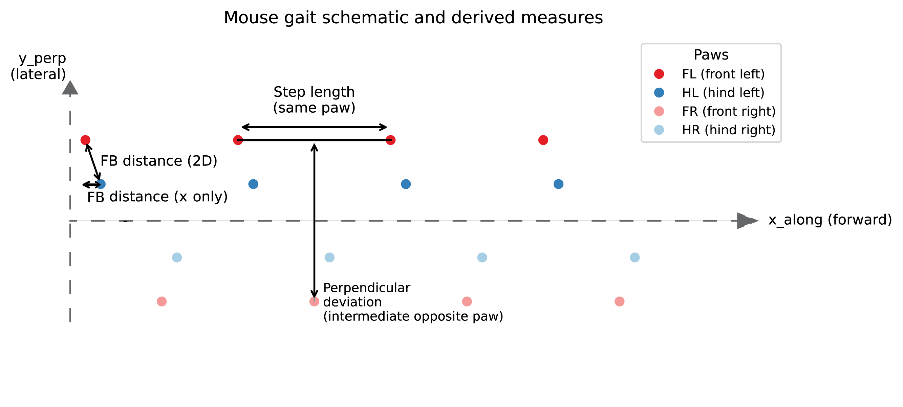

# Gait Analysis from Paw Prints (Shiny App)

## 1) What does this app do?

This Shiny app analyzes **mouse gait features** from paw-print coordinate data (e.g. footprint tracking from walking assays).
Starting from individual paw positions, it computes **mouse-level gait metrics** and visualizes them across genotypes,
treatments, or genotype–treatment combinations.

The app allows you to:
- Upload paw-print data from an Excel file
- Assign genotype and treatment (from file columns or manually)
- Optionally straighten walking trajectories (estimate the walking axis)
- Compute and visualize core gait measures
- Compare groups using **descriptive statistics only** (mean, SD, CV)
- Export mouse-level features and plots

⚠️ **No hypothesis testing is performed** (no p-values, no ANOVA, no t-tests).

---

## Schematic overview (recommended)



The schematic illustrates:
- **Step length** (same paw, along the walking direction)
- **Front–hind (FB) distance** as **2D** distance and as **x-only** distance
- **Perpendicular deviation (updated definition)** as the shortest distance from an “intermediate” paw print to the line
  connecting two consecutive prints of the opposite-side paw (computed separately for front and hind legs, and for L→R and R→L)

---

## 2) Input data format

### Required columns

Your Excel file **must** contain the following columns:

| Column name | Description |
|------------|-------------|
| `mouse_id` | Unique identifier for each mouse |
| `dot_id` | Sequential index of paw prints within a paw |
| `x` | X coordinate of paw print (pixels) |
| `y` | Y coordinate of paw print (pixels) |
| `paw` | Paw identity: `FL`, `FR`, `HL`, `HR` |

### Strongly recommended columns

| Column name | Description |
|------------|-------------|
| `image_id` | Identifier for the walking track / image |
| `pixels_per_cm` | Pixel-to-cm conversion factor |
| `genotype` | Genotype label (e.g. `wt`, `het`, `ko`) |
| `treatment` | Treatment label (e.g. `vehicle`, `drug`) |

Other columns (e.g. `sex`, `color`) are allowed and ignored unless explicitly used.

---

### Example input (excerpt)

```
mouse_id dot_id    x      y   image_id pixels_per_cm color paw sex genotype
193      1       426   1299   193_1     126.3         blue  HL  m   ko
193      2      1319.5 1346.5 193_1     126.3         blue  HL  m   ko
193      3      2315.5 1358.5 193_1     126.3         blue  HL  m   ko
193      4      3338.5 1367.5 193_1     126.3         blue  HL  m   ko
193      5       809.5 1577.5 193_1     126.3         blue  HR  m   ko
```

Notes:
- Coordinates can be integer or decimal.
- One row = one detected paw print.
- `dot_id` must increase along the walking direction **within each paw**.
- `pixels_per_cm` must be numeric (used for unit conversion).

---

## 3) Coordinate system used by the app

The app centers (and optionally aligns) each track to define:
- **x_along**: the walking direction (forward axis)
- **y_perp**: lateral deviation from the walking axis (side-to-side)

All reported gait measures are in **cm** (after dividing by `pixels_per_cm`).

---

## 4) Gait measures computed

All measures are computed per track and then summarized **per mouse**.

### 4.1 Step length

**What it measures:**  
How far the **same paw** moves forward between consecutive paw prints.

**How it’s calculated:**
- For each paw (FL, FR, HL, HR), sort prints along x_along
- Compute the difference between consecutive prints
- Average across all paws/steps for each mouse

**Equation (for a given paw):**
\[
\text{step\_length}_i = x_{i} - x_{i-1}
\]
Mouse-level mean:
\[
\overline{\text{step length}} = \frac{1}{N} \sum_{i=1}^{N} \text{step\_length}_i
\]

---

### 4.2 Front–hind (FB) distance — **two versions**

This app reports FB distance in two ways:

#### A) FB distance (2D)

**What it measures:**  
Full 2D spacing between paired front and hind paws (x and y both contribute).

**Equation:**
\[
\text{FB}_{2D} =
\sqrt{(x_\text{front} - x_\text{hind})^2 + (y_\text{front} - y_\text{hind})^2}
\]

#### B) FB distance (x-only)

**What it measures:**  
Forward spacing between paired front and hind paws **ignoring y**.

**Equation:**
\[
\text{FB}_{x} = |x_\text{front} - x_\text{hind}|
\]

**Note:** If you want a *pure lateral-only* FB measure, that would be:
\[
\text{FB}_{y} = |y_\text{front} - y_\text{hind}|
\]
(not currently included unless you ask for it).

---

### 4.3 Perpendicular deviation (updated definition)

**What it measures:**  
How much the gait alternation “wanders” laterally relative to the opposite-side step-to-step line.

**How it’s calculated (plain words):**
This is computed separately for:
- **Front legs** (FL/FR)
- **Hind legs** (HL/HR)

And in both directions:
1) **Left reference:** take two consecutive **left** steps (e.g. FL at step i and step i+1) → this defines a line.  
   Then find the **intermediate right** step whose x_along lies between them (e.g. FR) and compute the **shortest (perpendicular) distance** from that intermediate point to the line.

2) **Right reference:** same idea, but using two consecutive **right** steps and the intermediate **left** step.

**Point-to-line distance equation:**

For a line through points \((x_1, y_1)\) and \((x_2, y_2)\), and an intermediate point \((x_0, y_0)\):
\[
d_\perp =
\frac{|(x_2-x_1)(y_1-y_0) - (x_1-x_0)(y_2-y_1)|}
{\sqrt{(x_2-x_1)^2 + (y_2-y_1)^2}}
\]

---

## 5) Summary statistics used (descriptive only)

This app reports **descriptive statistics only**:

### Mean
\[
\mu = \frac{1}{N}\sum_{i=1}^{N} x_i
\]

### Standard deviation (SD)
\[
\sigma = \sqrt{\frac{1}{N-1}\sum_{i=1}^{N}(x_i - \mu)^2}
\]

### Coefficient of variation (CV)
\[
\text{CV} = \frac{\sigma}{|\mu|}
\]

Displayed as:
- Mean ± SD bar plots
- Mean CV ± SD bar plots
- Individual mice overlaid where appropriate

---

## 6) Genotype + treatment (`geno_trt`) grouping

When coloring by **genotype + treatment**, groups are ordered as:

```
geno1_trt1
geno1_trt2
geno2_trt1
geno2_trt2
```

The order is determined by how you write the genotype and treatment palettes
in the UI boxes (top-to-bottom). Colors use genotype as the base color, and
treatment is encoded by alpha shading (same color family).

---

## 7) Troubleshooting

If something looks wrong:

1. Check that `dot_id` increases correctly within each paw
2. Make sure `pixels_per_cm` is numeric and correct
3. Verify genotype/treatment spelling consistency
4. Try toggling “Straighten tracks” on/off
5. Restart the app and re-upload the file

If problems persist:

☎️ **Call your girlfriend.**  
She can probably fix the bug, but give her patience.
