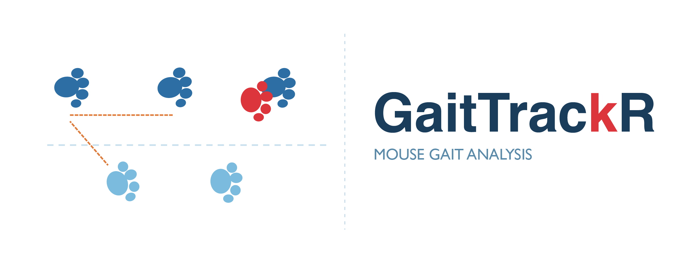
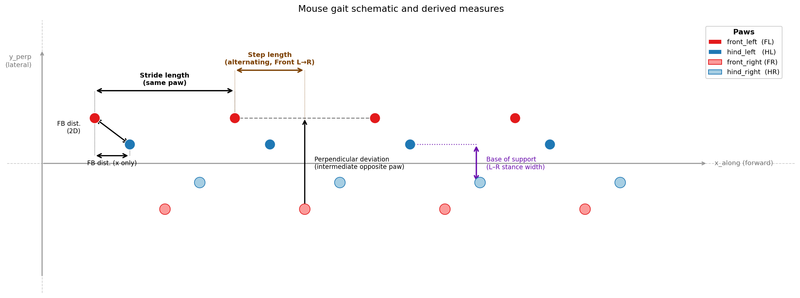

<p align="center">
  
</p>

<p align="center">
  <a href="https://opensource.org/licenses/MIT"></a>
  <a href="https://shiny.posit.co/"></a>
  
</p>

---

**GaitTrackR** is an interactive R Shiny app for analyzing mouse gait from paw-print coordinate data (e.g. footprint tracking from walking assays).
It includes a built-in image annotation tool to extract paw coordinates directly from photos, and computes a comprehensive set of mouse-level gait metrics that can be visualized across genotypes, treatments, or genotype–treatment combinations.

> ⚠️ **No hypothesis testing is performed.** GaitTrackR reports descriptive statistics only (mean, SD, CV). An exploratory effect-size overview (Cohen's d) is provided for hypothesis generation. Statistical comparisons are left to the user.

---

## Schematic overview



The schematic illustrates the core spatial measures:
- **Stride length** — same paw, between consecutive prints along the walking direction
- **Step length** — alternating L→R / R→L distance along the walking direction, computed separately for front and hind segments
- **Front–hind (FB) distance** — spacing between a paired front and hind paw, as full 2D distance or x-only
- **Perpendicular deviation** — shortest distance from an intermediate paw print to the line connecting two consecutive prints of the opposite-side paw (computed for front and hind, L-ref and R-ref)

---

## Requirements

- [R](https://cran.r-project.org/) (≥ 4.0)
- The following R packages (installed automatically on first run if missing):

```r
shiny, dplyr, tidyr, ggplot2, readxl, writexl, DT,
ggprism, ggpattern, ggrepel, scales, magick
```

---

## Quick Start

### 💻 From R console (any platform)

```r
shiny::runGitHub("GaitTrackR", "camillaelbaek", subdir = "GaitTrackR_App")
```

### Mac

Double-click `GaitTrackR_App/Mac_Run_Mouse_App.command`.

> First time only: right-click → Open → Open (to bypass Gatekeeper).

### Windows

Double-click `GaitTrackR_App/Windows_Run_Mouse_App.bat`.

> If R is not found, install it from [https://cran.r-project.org](https://cran.r-project.org) and try again.

---

## App structure

The app has three tabs:

### 🖼️ Tab 1 — Image → Data

Manually annotate paw-print coordinates directly from walking assay photos (JPG/PNG):

| Feature | Details |
|---|---|
| **Upload images** | JPG or PNG; navigate across multiple images |
| **Set scale** | Click two points on the ruler → enter the real-world distance in cm |
| **Add paw prints** | Click on the image to place points for each of the four paws |
| **Edit annotations** | Delete individual points, or toggle left ↔ right for any point |
| **Keyboard zoom** | `+` / `=` zoom in · `-` zoom out · `0` reset — centered on current view |
| **Save & export** | Save each annotated image to a temp store, then export all as a single `.xlsx` |

> 💡 The exported file is in exactly the format expected by the Feature Calculation tab.

---

### ⚙️ Tab 2 — Feature Calculation

Upload paw-coordinate data, map metadata, and compute all gait features:

| Feature | Details |
|---|---|
| **Upload data** | `.xlsx` file with paw-print coordinates (see format below) |
| **Straighten tracks** | Optional: fit and align each track to its principal walking axis |
| **Step pairing** | Configurable max gap (cm) for pairing front–hind prints within a side |
| **Body-length normalisation** | Optionally express all distance measures as a fraction of body length |
| **Metadata mapping** | Map genotype, treatment, and mouse length from file columns — with auto-detection badges and group-size preview — or enter manually in an editable table |
| **Exclude mice** | Enter mouse IDs to remove from all downstream analyses |
| **Export** | Mouse-level feature table and step-level event tables as `.xlsx` |

---

### 📊 Tab 3 — Plotting

Visualize computed features with full grouping and palette control:

| Plot type | Description |
|---|---|
| **Overview (bubble)** | Effect size (Cohen's d) for all measures vs a reference group — useful for an at-a-glance comparison |
| **Mean ± SD** | Bar plot of the group mean with SD error bars for a chosen measure |
| **Mean CV ± SD** | Same for the coefficient of variation |
| **FB distance per side** | Front–hind distance split by L/R side |
| **Perpendicular deviation per segment** | Deviation split by front / hind segment |
| **Base of support** | Left–right stance width per segment |
| **Paw overlap** | Absolute hind-over-front overlap distance |
| **Per-paw stride length** | Individual stride lengths for each of the four paws |
| **L–R asymmetry index** | Normalized left–right stride asymmetry per limb set |
| **Drift / stability** | Mean \|y_perp\|, SD, and range of lateral deviation |
| **QC tracks** | Raw or aligned paw trajectories per mouse for quality control |

All bar plots show group mean ± SD with individual mouse points overlaid.

**Grouping and color:** color by genotype, treatment, or genotype+treatment. Palette order and colors are fully editable (name = hex, one per line); order of lines sets factor order on all axes.

---

## Input data format

> 📥 **[Download the template Excel file](templates/GaitTrackR_template.xlsx)**
> The file contains two sheets: **`paw_coordinates`** with four example mice (wt/ko × vehicle/drug) ready to replace with your data, and **`column_guide`** with a full description of every column, whether it is required, and example values.

Your `.xlsx` file **must** contain these columns:

| Column | Description |
|---|---|
| `mouse_id` | Unique identifier for each mouse |
| `dot_id` | Sequential index of paw prints within a paw (must increase along walking direction) |
| `x` | X coordinate of paw print (pixels) |
| `y` | Y coordinate of paw print (pixels) |
| `paw` | Paw identity: `front_left`, `front_right`, `hind_left`, or `hind_right` |

Strongly recommended:

| Column | Description |
|---|---|
| `image_id` | Identifier for the walking track / image |
| `pixels_per_cm` | Pixel-to-cm conversion factor (numeric) |
| `genotype` | Genotype label (e.g. `wt`, `het`, `ko`) |
| `treatment` | Treatment label (e.g. `vehicle`, `drug`) |
| `mouse_length_cm` | Body length in cm (required for normalised measures) |

Any additional columns are carried through but otherwise ignored.

---

## Gait measures computed

All measures are computed per track and summarised per mouse (mean, CV where applicable).

| Measure | Description |
|---|---|
| **Stride length** | Forward distance between consecutive prints of the same paw; mean and CV across all paws, and per paw |
| **Step length** | Alternating L→R / R→L distance; mean and CV separately for front and hind segments |
| **L–R symmetry index** | `\|L − R\| / mean(L, R)` of per-paw stride length, for front and hind |
| **Diagonal coupling phase** | Phase (0–1) at which the diagonal front paw lands within the hind stride cycle |
| **FB distance (2D)** | Full 2D spacing between paired front and hind paw on the same side; mean and CV |
| **FB distance (x-only)** | Forward-only component of the above; mean and CV |
| **Paw overlap** | Signed and absolute forward distance of hind print relative to paired front print |
| **Base of support** | Left–right stance width (y_perp distance between L and R prints); mean and CV for front and hind |
| **Perpendicular deviation** | Shortest distance from an intermediate print to the line defined by two consecutive opposite-side prints; mean and CV |
| **L–R asymmetry index** | Normalised left–right asymmetry of per-paw stride lengths, for front and hind |
| **Lateral drift** | Mean \|y_perp\|, SD(y_perp), and range(y_perp) across all prints |

Body-length-normalised versions (measure / `mouse_length_cm`) are computed for all distance-based measures when a length column is provided.

---

## Troubleshooting

1. Check that `dot_id` increases along the walking direction within each paw
2. Check that `paw` values are exactly `front_left`, `front_right`, `hind_left`, `hind_right`
3. Make sure `pixels_per_cm` is numeric and consistent within each image
4. Verify that genotype/treatment spelling in the file matches the palette names in the Plotting tab
5. Try toggling **Straighten tracks** on/off — useful if the mouse did not walk in a straight line
6. If feature values look wrong for a single mouse, use the **QC tracks** plot to inspect its trajectories
7. Restart the app and re-upload the file if the UI becomes unresponsive

---

## Citation

If you use **GaitTrackR** in your research, please cite:

> Elbaek, CR. (2026). *GaitTrackR: An interactive Shiny app for mouse gait analysis from paw-print coordinate data*. GitHub. https://github.com/camillaelbaek/GaitTrackR

---

## License

This project is licensed under the **MIT License** — see the [LICENSE](LICENSE) file for details.

---

## Contact

For questions or bug reports, please open a [GitHub issue](https://github.com/camillaelbaek/GaitTrackR/issues).
